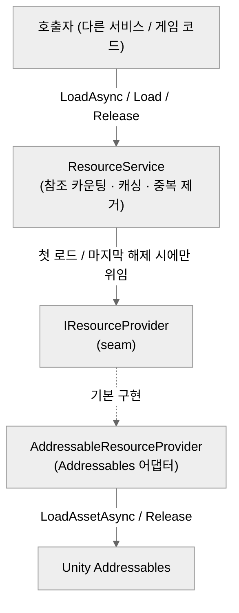
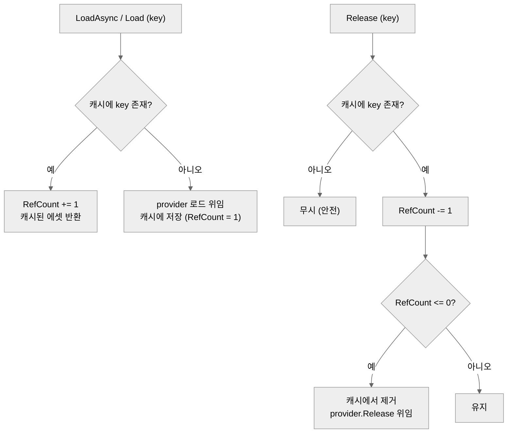
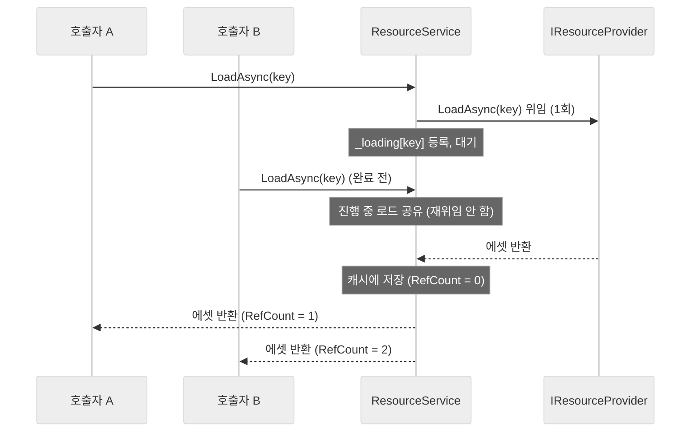

# ResourceService

Addressables 기반의 **범용 에셋 로더 서비스**입니다. 임의 타입 `T`의 에셋을 키로 로드/해제하는 단일 진입점을 제공하고, **참조 카운팅**으로 핸들 생명주기를 안전하게 관리합니다. 프로젝트의 다른 서비스들이 리소스 로드를 이 로더에 위임하도록 설계되었습니다.

- **Addressables 전용** — `Resources.Load` 폴백 없음
- **비동기/동기** 로드 모두 지원 (`LoadAsync<T>` / `Load<T>`)
- **키 단위 캐싱 + 참조 카운팅** — 참조가 0이 되면 실제 Addressables 핸들 해제
- **진행 중(in-flight) 중복 제거** — 같은 키를 동시에 로드해도 실제 로드는 1회

---

## 구조

| 파일 | 책임 |
| --- | --- |
| `ResourceService.cs` | `IResourceService` 인터페이스 + 구현. **참조 카운팅·캐싱·중복 제거**만 담당 |
| `IResourceProvider.cs` | 실제 로딩 백엔드를 추상화한 seam(인터페이스). 테스트 시 대체 가능 |
| `AddressableResourceProvider.cs` | `IResourceProvider`의 Addressables 어댑터. `LoadAssetAsync` / `WaitForCompletion` / `Addressables.Release` 와 키→핸들 매핑 보관 |



`ResourceService`는 캐시에 없을 때(참조 0 → 1)만 provider에 로드를 위임하고, 참조가 0으로 떨어질 때만 provider에 해제를 위임합니다. 즉 **Addressables 호출은 키당 최소화**됩니다.

---

## 동작 방식

### 참조 카운팅 흐름



- 같은 키를 N번 로드하면 RefCount는 N이 되고, **N번 Release해야** 실제 해제됩니다.
- 보유 참조보다 많이 Release해도 안전하게 무시됩니다.
- `Dispose()`는 남아 있는 모든 키의 핸들을 일괄 해제합니다.

### 동시 로드 중복 제거 (in-flight)

같은 키의 `LoadAsync`가 완료되기 전에 다시 호출되면, 진행 중인 로드를 공유하여 provider 호출을 1회로 묶습니다. (`UniTaskCompletionSource` 기반)



---

## 사용법

### 1) DI 등록 (VContainer)

```csharp
using VContainer;
using VContainer.Unity;
using DarkNaku.FoundationDI;

public class RootLifetimeScope : LifetimeScope
{
    protected override void Configure(IContainerBuilder builder)
    {
        // 기본 생성자가 AddressableResourceProvider를 주입
        builder.Register<IResourceService, ResourceService>(Lifetime.Singleton);
    }
}
```

### 2) 비동기 로드 / 해제

```csharp
public class Example
{
    private readonly IResourceService _resource;

    public Example(IResourceService resource) => _resource = resource;

    public async UniTask ShowIconAsync(Image target)
    {
        // Addressables 주소(또는 키)로 로드
        var sprite = await _resource.LoadAsync<Sprite>("ui_icon_coin");
        target.sprite = sprite;

        // 사용이 끝나면 같은 키로 해제 (참조 카운트 감소)
        _resource.Release("ui_icon_coin");
    }
}
```

### 3) 동기 로드

```csharp
// WaitForCompletion 기반 — 블로킹이 허용되는 초기화 등에서 사용
var prefab = _resource.Load<GameObject>("enemy_slime");
var instance = Object.Instantiate(prefab);
_resource.Release("enemy_slime");
```

### 4) 일괄 정리

```csharp
// 서비스 종료/씬 정리 시 남은 모든 핸들 해제
(_resource as IDisposable)?.Dispose();
// DI 컨테이너가 Singleton 수명을 관리하면 컨테이너 Dispose 시 자동 호출됨
```

> **로드/해제 짝 맞추기** — `LoadAsync`/`Load` 1회당 `Release` 1회가 원칙입니다. 짝이 맞지 않으면 핸들이 조기 해제되거나(과다 Release) 메모리에 남습니다(Release 누락).

---

## 테스트

EditMode 단위 테스트(`Assets/FoundationDI/Tests/ResourceServiceTest.cs`)는 `IResourceProvider`를 **NSubstitute로 대체**하여, 실제 Addressables 빌드 없이 참조 카운팅·캐싱·중복 제거 로직을 검증합니다. 실제 Addressables 연동(`AddressableResourceProvider`)은 PlayMode 검증 대상입니다.

---

## 한계 / 후속 과제

- **에러 처리 미구현(범위 외)** — `LoadAsync` 진행 중 provider가 예외를 던지면 대기 중인 호출자가 완료되지 않을 수 있습니다. 에러 전파는 후속 과제입니다.
- **스레드 안전성 없음** — Unity 메인 스레드 사용을 전제로 합니다.
- **기존 서비스 위임** — PoolService/SoundService가 이 로더를 사용하도록 전환하는 작업은 별도 계획으로 진행됩니다.
